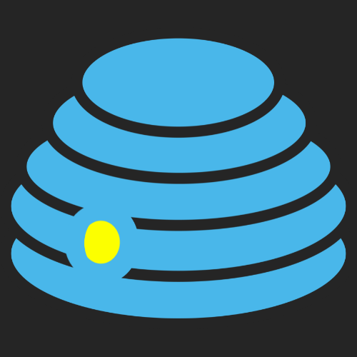

---
# Feel free to add content and custom Front Matter to this file.
# To modify the layout, see https://jekyllrb.com/docs/themes/#overriding-theme-defaults

layout: default
title: Home
---

We believe that social media should be open, transparent, and user-controlled. That's why we are creating Hive Open Media, an open-source social media platform that puts you in charge of your content and data.

The first step is to create a platform that respects your privacy, protects your data, and empowers you to share and connect with others without sacrificing your rights. We are committed to building a community-driven platform that prioritizes user needs and values.

Join us on this journey to create a better social media experience for everyone. Together, we can build a platform that respects your privacy, values your data, and empowers you to control your online presence. Welcome to Hive Open Media!

Come join us, we'd love your support by way of time (message us via support@hiveopenmedia.org to discuss ways to help) or help us directly with funding via [Patreon].

[patreon]: https://patreon.com/hiveopenmedia
